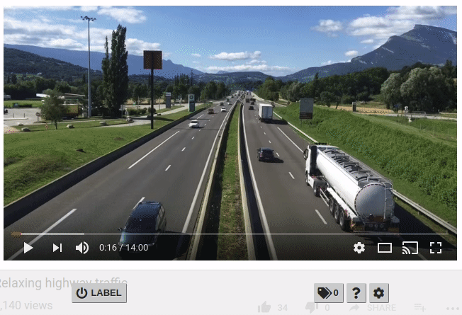

Web Video Labeler is a browser extension to step through videos and generate label annotations in formats ready for training.

## Features
- Draw and edit bounding box annotations on any `<video>`
- Compatible with **Chrome** and **Firefox**
- Output annotations compatible **Darknet (YOLO)** and **Pascal VOC XML**
- Save locally or upload directly to **AWS S3**
- Object tracker follows labeled objects for semi-automated labeling
- _Darknet output_: combine multiple datasets

## Installation

- **Chrome**: Download the latest `.crx` release from the [Releases page](https://github.com/danrouse/web-video-labeler/releases). At the top right of Chrome, click  → More tools → Extensions (or visit [chrome://extensions](chrome://extensions)), then drag and drop the downloaded `.crx` package onto your browser.
- **Firefox**: Download the latest `.xpi` release from the [Releases page](https://github.com/danrouse/web-video-labeler/releases). Firefox will prompt you to install the extension.

### From source

1. `npm install && npm run build`
2. Load the unpacked extension
  - **Chrome**: [Instructions on Chrome Developers](https://developer.chrome.com/extensions/getstarted) _(at the bit about navigating to `chrome://extensions`)_
  - **Firefox**: [Instructions on MDN](https://developer.mozilla.org/en-US/docs/Mozilla/Add-ons/WebExtensions/Temporary_Installation_in_Firefox)

## Usage

- Visit a web page with a video on it, such as on YouTube. A toolbar should appear at the bottom of your screen to manage the labeling process.
- Click  **LABEL** to begin labeling the video.
- Draw and edit labels on the video using your mouse:
  - Labels can be moved and resized
  - To change the label name, click on the name and select or enter a new class
  - Edit details such as pose by clicking on 
  - Clone a label by clicking on 
  - Delete a label by right-clicking on it or by clicking on 
- When the frame is fully labeled, click  **NEXT** to download the image and labels, and to skip the video forward.
  - If object tracking is enabled, labels will attempt to follow their objects
- (_Darknet output only_) After all of the data is saved, run the downloaded script `prepare_darknet_training_data.py` to prepare the dataset with class IDs.

### Controls

-  Start/stop labeling
-  Erase labels currently drawn on frame
-  Undo saving last frame
-  Step backward
-  Step forward
-  Open class manager, to remove or import lists of label classes
-  Open settings menu

### Object tracker

By default, labels will attempt to track the motion of whatever they are labeling (using [dlib's correlation tracker](https://github.com/danrouse/dlib-correlation-tracker-js/)). In most cases, this should be helpful (but not perfect), but it may cause performance issues or be inappropriate for your context. This feature can be disabled through the  Settings menu.

### Saving to AWS S3

Instead of saving to your local disk, image and annotation data can be saved directly to an AWS S3 bucket. This feature can be enabled through the  Settings menu, and requires you to configure your AWS region, bucket, and access key ID and secret access key for authentication.
